# String Calculator TDD Kata

A Test-Driven Development exercise implementing a string calculator with incremental functionality.

## Project Structure

test-case/
├── src/
│   ├── main/java/co/incubyte/stringcalculator/
│   │   └── StringCalculator.java
│   └── test/java/co/incubyte/stringcalculator/
│       └── StringCalculatorTest.java
├── README.md
└── pom.xml

## TDD Progress

### ✅ Step 1: Empty String Returns Zero

- **Test**: `testEmptyStringReturnsZero()`
- **Implementation**: Return 0 for empty string

### 🔄 Step 2: Single Number

- **Test**: `testSingleNumberReturnsValue()`
- **Implementation**: Parse single number

### 🔄 Step 3: Two Numbers

- **Test**: `testTwoNumbersReturnSum()`
- **Implementation**: Two number sum

### 🔄 Step 4: Multiple Numbers

- **Test**: `testMultipleNumbersReturnSum()`
- **Implementation**: Multiple number sum

### 🔄 Step 5: New Lines Between Numbers

- **Test**: `testNewLinesAndCommasReturnSum() & testNewLinesOnlyReturnSum()`
- **Implementation**: Numbers with new line sum

### 🔄 Step 6: Custom Delimiter with Numbers

- **Test**: `testCustomDelimiterReturnSum() & testCustomDelimiterWithMultipleNumbers()`
- **Implementation**: Custom delimiter numbers sum

### 🔄 Step 7: Negative Numbers Exception

- **Test**: `testNegativeNumberThrowsException() & testMultipleNegativeNumbersThrowsException()`
- **Implementation**: Negative numbers throws exception

## Requirements Implemented

- [ ] Empty string returns 0
- [ ] Single number returns the number itself
- [ ] Two numbers, comma delimited, returns the sum
- [ ] Handle any amount of numbers
- [ ] Handle new lines between numbers
- [ ] Support different delimiters
- [ ] Throw exception for negative numbers

## Test Results

### Failed Test Example

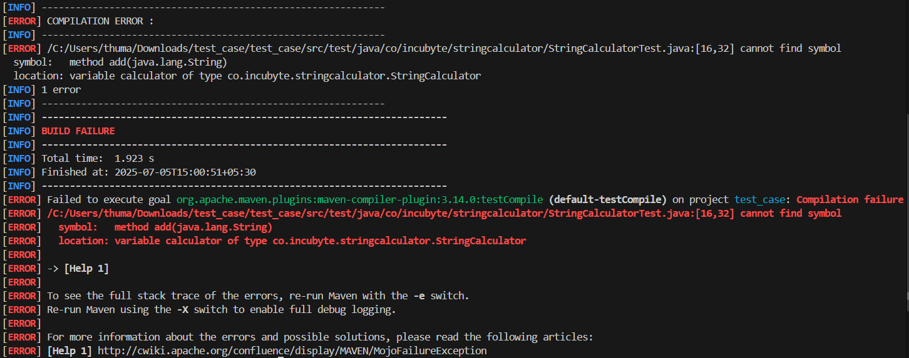

### Successful Test Example

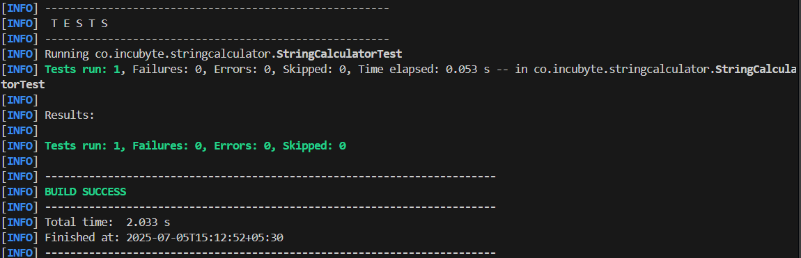

### Failed Test Example

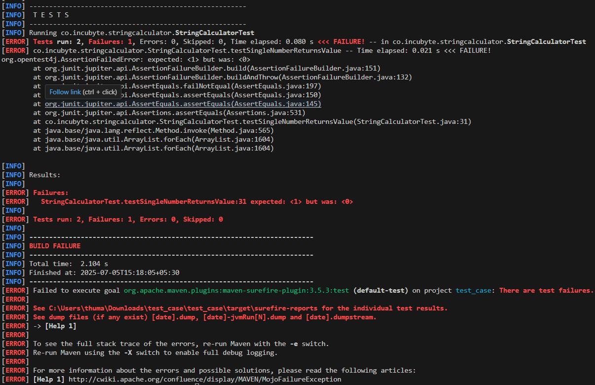

### Successful Test Example

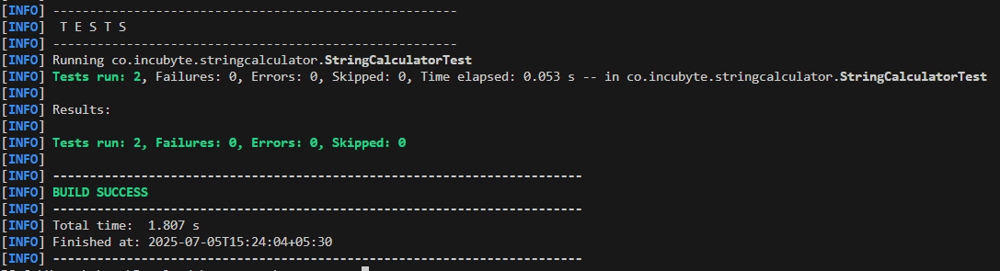

### Failed Test Example

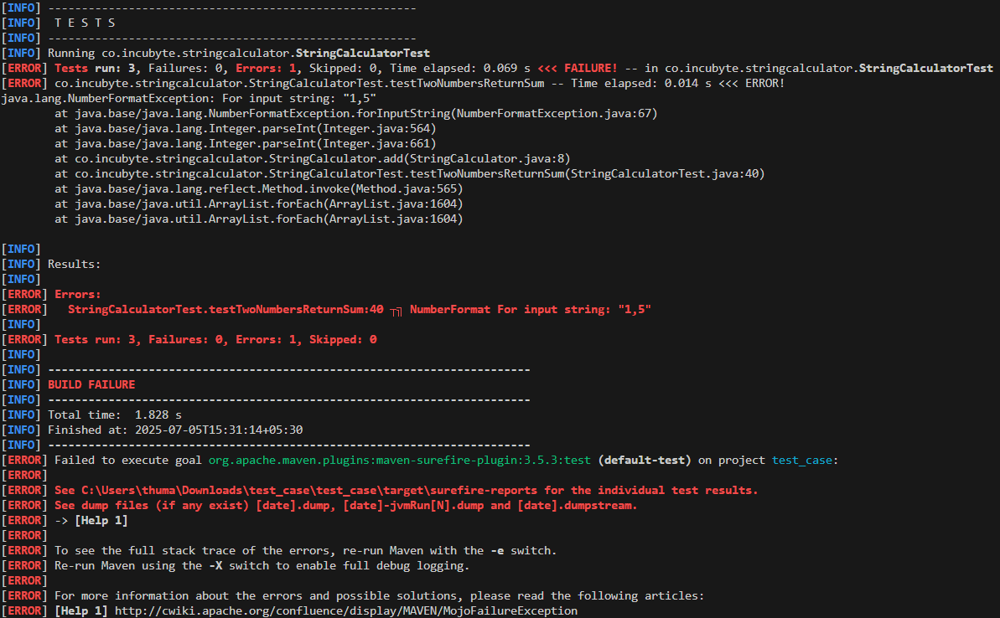

### Successful Test Example

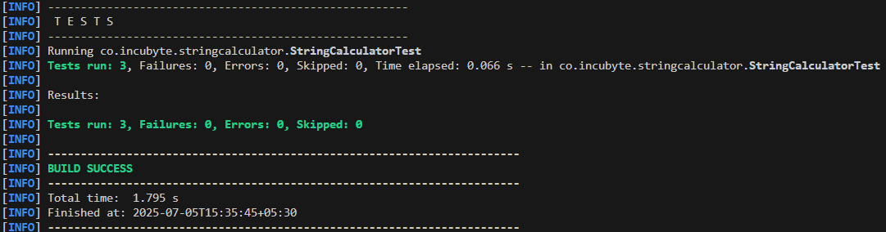

### Failed Test Example

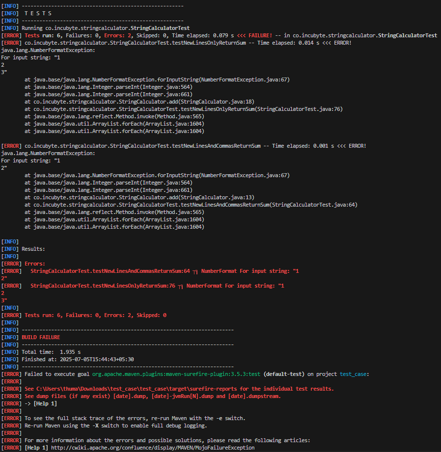

### Successful Test Example


### Successful Test Example

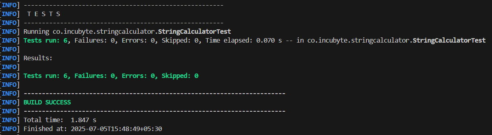

### Failed Test Example

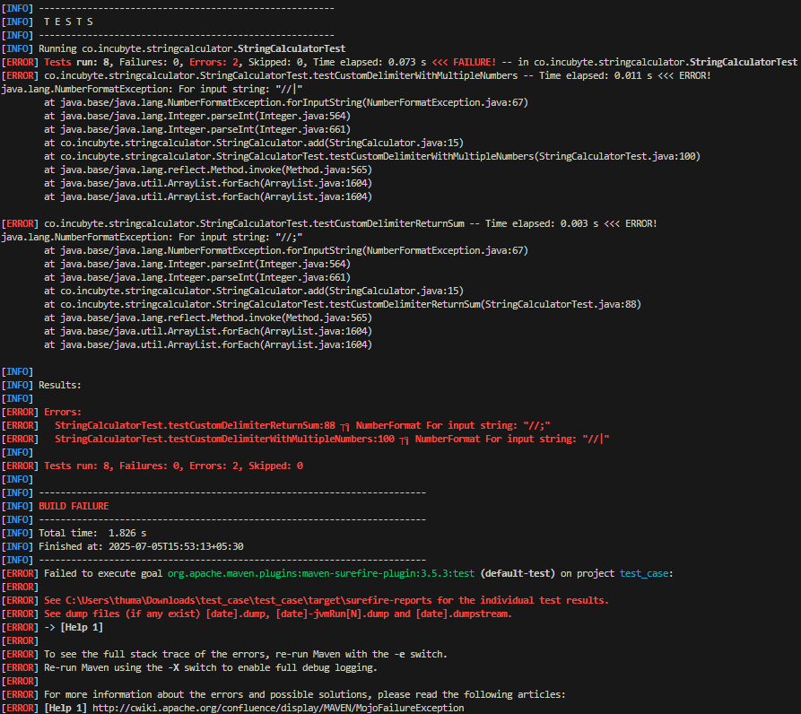

### Successful Test Example

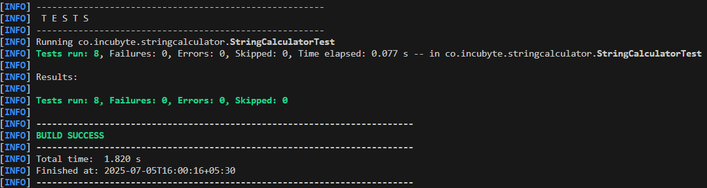

### Failed Test Example

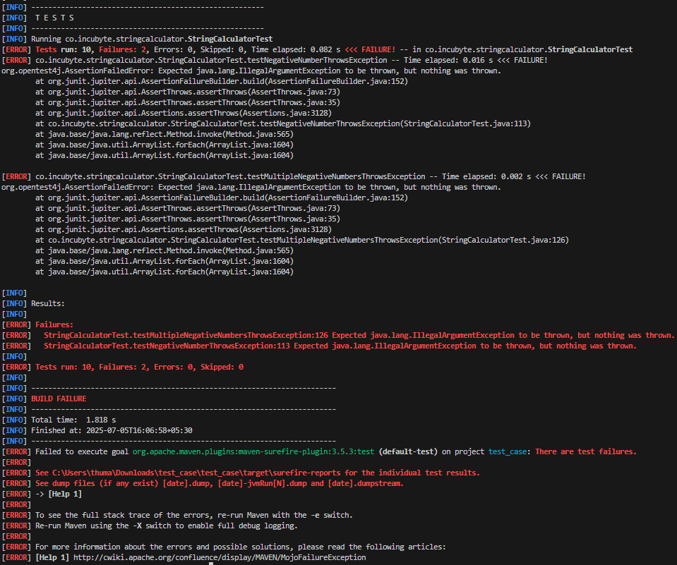

### Successful Test Example

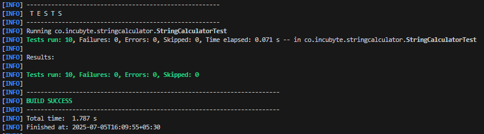

## Running Tests

```bash
mvn test -Dtest=StringCalculatorTest
